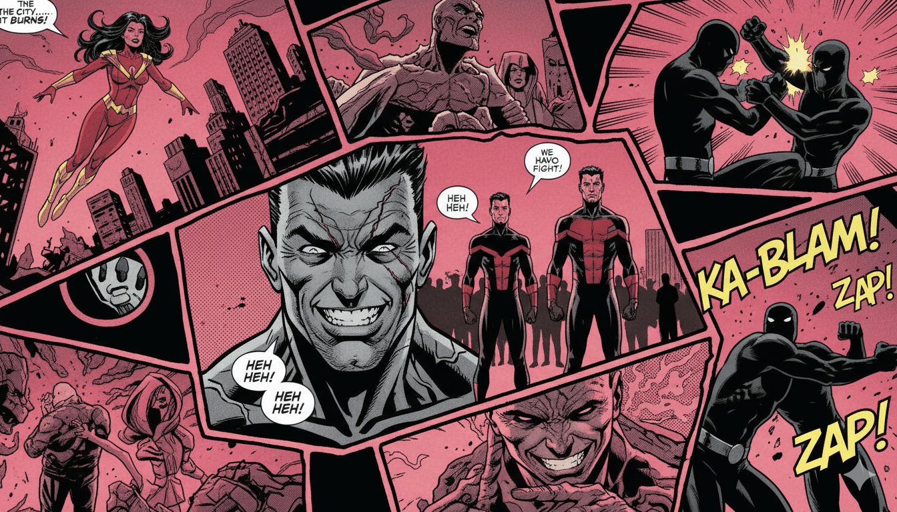

# SuperHero ADA - Buscador de Héroes

Una aplicación web interactiva para buscar, filtrar y explorar el universo de superhéroes. Este proyecto consume la [SuperHero API](https://akabab.github.io/superhero-api/api/) y presenta los datos con una estética única estilo **Cómic/Cyberpunk**, optimizada para todos los dispositivos.



## Funcionalidades Principales

### Búsqueda y Filtrado
- **Buscador en tiempo real:** Permite encontrar héroes por nombre.
- **Ordenamiento:** Capacidad de ordenar los resultados de forma Ascendente (A-Z) y Descendente (Z-A).
- **Feedback Visual:** Loader animado estilo cómic ("KA-POW!") durante la espera de resultados.

### Paginación Avanzada
- Visualización de **20 resultados por página**.
- Controles completos de navegación:
  - `<<` Ir al principio.
  - `<` Anterior.
  - `>` Siguiente.
  - `>>` Ir al final.
- **Selector de Página:** Un `select` dinámico permite saltar a cualquier página específica.
- **Barra de Estado (HUD):** Indicador visual de la página actual y el total de héroes encontrados.
- **Validación:** Los botones se deshabilitan visual y funcionalmente cuando no hay más páginas.

### Tarjetas de Héroes (Cards)
- **Diseño Interactivo:** Efectos de zoom y brillo al pasar el mouse.
- **Alineación Temática:** El borde y los indicadores cambian de color según el bando del personaje:
  - **Good:** Cyan.
  - **Bad:** Fucsia.
  - **Neutral:** Amber.
- **Lógica Responsive (Touch-Friendly):**
  - En **Desktop**: La información técnica aparece al hacer *hover*.
  - En **Móvil/Tablet**: La información está siempre visible para facilitar la lectura sin mouse.

### Ficha Técnica (Modal)
- Visualización detallada sin recargar la página.
- **Diseño Adaptativo:**
  - **Móvil:** Diseño vertical con scroll.
  - **Desktop:** Diseño de 3 columnas (Poster | Bio | Stats) aprovechando pantallas anchas.
- **Estadísticas Visuales:** Barras de poder y tarjetas de atributos con iconos temáticos.

### UI/UX y Estética
- **Dark Mode:** Soporte completo para tema claro y oscuro con persistencia en `localStorage`.
- **Cursores Personalizados:** Puntero de precisión y mira telescópica que reacciona a los elementos interactivos (Solo en PC).
- **Animaciones:** Uso de Tailwind CSS y animaciones custom (`animate-bounce`, `comic-pop`, `shockwave`).

---

## Tecnologías Utilizadas

*   **HTML5 Semántico:** Estructura optimizada y accesible (`aria-labels`).
*   **CSS3 & Tailwind CSS:** Estilizado mediante clases utilitarias y variables CSS personalizadas (`--primary`, `--accent`) para el manejo de temas.
*   **JavaScript (ES6 Modules):** Código modular dividido en responsabilidades únicas:
    *   `main.js`: Punto de entrada.
    *   `fetch.js`: Comunicación con la API.
    *   `render.js`: Creación del DOM para las tarjetas.
    *   `paginated.js`: Lógica de paginación.
    *   `modal.js`: Control de la ventana modal.
    *   `filters.js`: Lógica de búsqueda y orden.
    *   `loader.js`: Animaciones de carga.
    *   `cursor.js`: Lógica del puntero personalizado.
    *   `dark-mode.js`: Gestión del tema visual.
*   **FontAwesome:** Iconografía vectorial.

---

## Estructura del Proyecto

```text
SUPERHEROADA-FRONT/
│
├── assets/
│   └── banner.webp       # Imágen optimizada de fondo
│
├── css/
│   └── styles.css        # Configuraciones custom, animaciones y scrollbars
│
├── js/
│   ├── cursor.js         # Efecto de cursor y mira
│   ├── dark-mode.js      # Lógica Claro/Oscuro
│   ├── fetch.js          # Llamada a la API
│   ├── filters.js        # Lógica de búsqueda
│   ├── loader.js         # Animación "KA-POW"
│   ├── main.js           # Orquestador principal
│   ├── modal.js          # Lógica de la ficha técnica
│   ├── paginated.js      # Control de páginas
│   └── render.js         # Generador de HTML (Cards)
│
├── index.html            # Estructura principal
└── README.md             # Documentación
```

---

## Instalación y Uso

Dado que el proyecto utiliza **ES Modules** (`type="module"` en los scripts), es necesario ejecutarlo a través de un servidor local para evitar errores de CORS.

1.  **Clonar el repositorio:**
    ```bash
    git clone https://github.com/TU_USUARIO/superhero-ada.git
    ```
2.  **Abrir con VS Code:**
    ```bash
    code superhero-ada
    ```
3.  **Ejecutar con Live Server:**
    *   Instala la extensión "Live Server" en VS Code.
    *   Haz clic derecho en `index.html` y selecciona **"Open with Live Server"**.

---

## Desafíos Implementados

Este proyecto cumple con los requisitos obligatorios y los desafíos opcionales propuestos:

*   ✅ **Paginado funcional:** 20 items por página con navegación completa.
*   ✅ **Estados de botones:** Deshabilitados correctamente en la primera/última página.
*   ✅ **Total de páginas:** Indicador visual "Página X de Y".
*   ✅ **Ir a página específica:** Implementado mediante un `<select>` dinámico.
*   ✅ **Persistencia de búsqueda:** Al usar un sistema de **Modal** en lugar de navegar a otra URL, la búsqueda y la página actual se mantienen intactas al cerrar la ficha del personaje.

---

## Autor

**Antonela Borgogno**
*   Carrera: FrontEnd - ADA ITW
*   Módulo: 3
